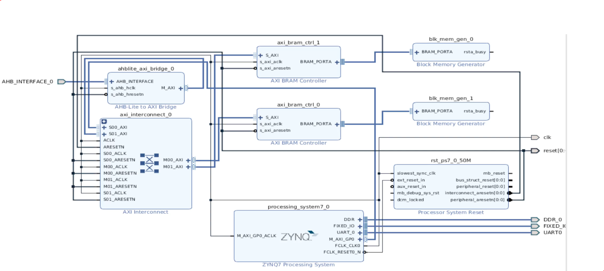
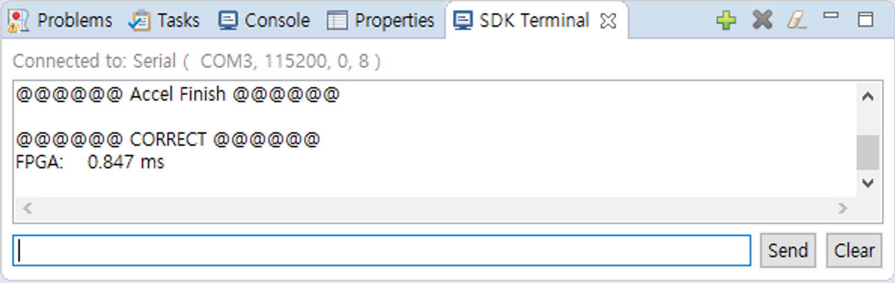

# CNN_Accelerator(FPGA Design)

The goals of the project are to design CNN(Convolution Neural Network) accelerator using xilinx FPGA board and to compare performance with CPU.

# Experimental Env.
* ```Zynq-7000 SoC``` <br>
* ```Xilinx Vivado 2018.2```

# Design diagram
<br>

# File hierarchy

1. Design Source
    * top(design_1_warpper.v)
        * p_1: vector_add(vector_add.v)
        * sf_1: start_end(start_end.v)
        * design_1_i : design_1(design_1.bd)
    
2. Constraints
    * constrs_1
        * top.xdc
   
3. Simulation Sources
    * sim_1
        * test_bench(design_1_wrapper.v)
        * top

# Run
       
 Follow the design and file structures, then you can simulate by using test_bench module. Execute and compare the result to typical C code(go to "Lanch SDK" menu). Copy and paste the "main.c" in the C language editor window. You can see the execution time for the CNN in both FPGA and CPU.

# Result
<br>
